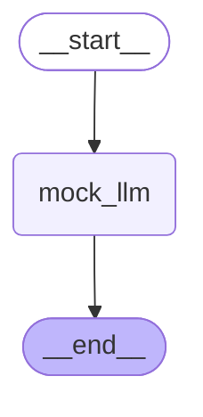

```mermaid
graph TD;
    __start__([__start__]):::first
    mock_llm(mock_llm)
    __end__([__end__]):::last
    __start__ --> mock_llm;
    mock_llm --> __end__;
    classDef default fill:#f2f0ff,line-height:1.2
    classDef first fill-opacity:0
    classDef last fill:#bfb6fc
```