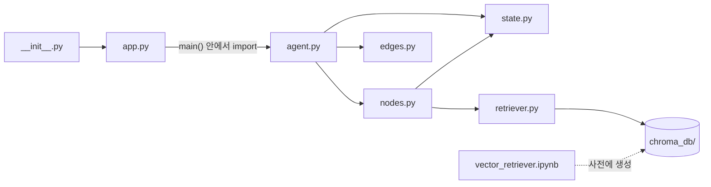
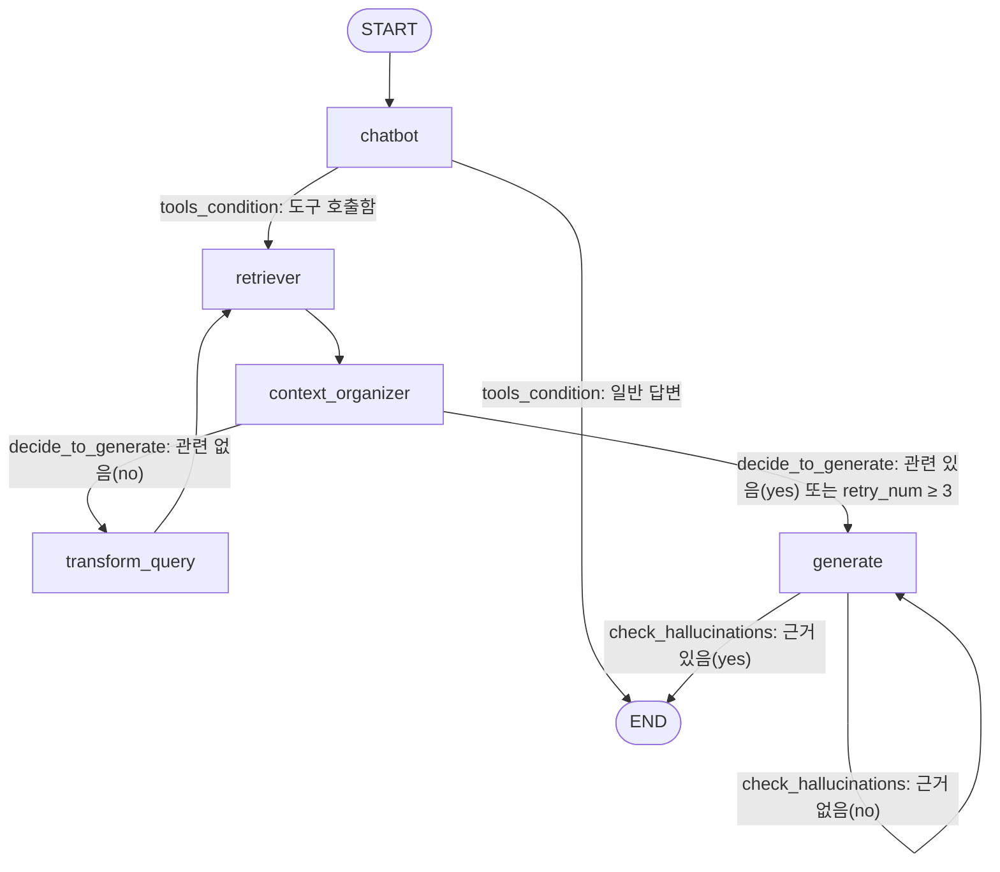

# ex_1006 RAG 싱글 에이전트 구조

「한글맞춤법 표준어규정 해설.pdf」를 벡터 DB(Chroma)에 저장해 두고, 사용자 질문에 대해
**검색 → 문서 정리 → 관련성 평가 → (필요하면 질문 재작성 후 재검색) → 답변 생성 → 환각 검사**
흐름으로 답변하는 LangGraph 기반 Self-RAG 형태의 싱글 에이전트입니다.

---

## 1. 파일 구성

```
ex_1006/
├── pyproject.toml          # 패키지 정의, 실행 스크립트(ex-1006 = "ex_1006:main")
├── langgraph.json          # LangGraph 서버(langgraph dev)용 그래프 등록
├── .env                    # OPENAI_API_KEY 등 환경변수
├── 한글맞춤법 표준어규정 해설.pdf   # 원본 문서
└── src/ex_1006/
    ├── __init__.py         # 패키지 진입점: app.main 을 노출
    ├── app.py              # main(): agent.run() 호출
    └── rag_agent/
        ├── vector_retriever.ipynb  # (사전 작업) PDF → 청크 → Chroma DB 생성
        ├── chroma_db/              # 노트북이 만든 벡터 DB (영구 저장)
        ├── retriever.py            # Chroma DB 로드 → retriever / retriever_tool
        ├── state.py                # 그래프 상태(AgentState) 정의
        ├── nodes.py                # 그래프의 노드(작업 단위) 함수들
        ├── edges.py                # 조건부 분기 함수들 (LLM 평가자)
        └── agent.py                # 노드·엣지를 조립해 graph 컴파일 + run()
```

| 파일 | 역할 | 주요 객체 |
|---|---|---|
| `vector_retriever.ipynb` | PDF를 `PyMuPDFLoader`로 읽고 `RecursiveCharacterTextSplitter(500, 50)`로 쪼갠 뒤 `text-embedding-3-small`로 임베딩해 `chroma_db/`에 저장 (한 번만 실행) | - |
| `retriever.py` | 저장된 `chroma_db/`를 열어 검색기 생성 | `vectorstore`, `retriever`(k=3), `retriever_tool`(이름 `pdf_search`) |
| `state.py` | 노드들이 주고받는 공유 상태 | `AgentState` |
| `nodes.py` | 실제 일을 하는 함수 5개 | `chatbot`, `retrieve`, `context_organizer`, `transform_query`, `generate` |
| `edges.py` | 다음에 어느 노드로 갈지 결정하는 함수 2개 | `decide_to_generate`, `check_hallucinations` |
| `agent.py` | 그래프 조립 및 실행 | `graph`, `run()` |
| `app.py` / `__init__.py` | 명령행 실행 진입점 | `main()` |

---

## 2. 모듈 import 관계



- `retriever.py`, `nodes.py`, `edges.py`는 **import 되는 순간** 모듈 최상단 코드가 실행됩니다.
  (`load_dotenv()`, `ChatOpenAI(model="gpt-4o")` 생성, Chroma DB 로드 등)
- `agent.py`도 import 시점에 `graph = graph_builder.compile()`까지 실행되므로,
  `langgraph.json`이 `agent.py:graph`를 바로 가져다 쓸 수 있습니다.

---

## 3. 실행 방법 (두 가지 진입점)

### (1) 명령행 실행: `uv run ex-1006`

```
pyproject.toml [project.scripts] ex-1006 = "ex_1006:main"
  → ex_1006/__init__.py   ("프로젝트 초기화 init" 출력, app.main 노출)
  → app.main()            ("app파일" 출력)
  → rag_agent.agent.run()
       1) graph.png 로 그래프 구조 이미지 저장 (실패 시 무시)
       2) graph.stream({"messages": ["구개음화가 뭐야?"]})
       3) 각 노드가 끝날 때마다 "--- 노드이름 ---"과 메시지 내용 출력
```

`python -m ex_1006.rag_agent.agent` 로 agent.py만 단독 실행해도 같은 `run()`이 돌아갑니다.
(`retriever.py`도 단독 실행 시 검색 도구만 테스트합니다.)

### (2) LangGraph Studio: `langgraph dev`

`langgraph.json`의 `"rag_agent": "./src/ex_1006/rag_agent/agent.py:graph"` 설정으로
컴파일된 `graph` 객체를 서버에 올립니다. 이 경우 `run()`은 호출되지 않습니다.
(`.langgraph_api/` 폴더는 이때 생기는 로컬 체크포인트 저장소입니다.)

---

## 4. 상태(State) — `state.py`

```python
class AgentState(MessagesState):   # messages: list (자동으로 누적/append)
    question: str    # 현재 검색에 쓰는 질문 (transform_query가 덮어씀)
    context: str     # 검색 결과 → 정리된 문서 텍스트
    answer: str      # generate가 만든 최종 답변
    retry_num: int   # 질문 재작성 횟수
```

- 그래프 생성 시 `StateGraph(AgentState, input_schema=MessagesState)` 로 지정했기 때문에
  **입력은 `messages`만** 받고, 나머지 필드는 노드들이 채워 넣습니다.
- 각 노드는 바뀐 필드만 dict로 반환합니다. `messages`는 리스트에 **추가**되고,
  나머지 필드는 **덮어쓰기**됩니다.

---

## 5. 그래프 흐름 — `agent.py`



### 노드 (nodes.py)

| 노드 이름 | 함수 | 하는 일 | 상태 변경 |
|---|---|---|---|
| `chatbot` | `chatbot` | `retriever_tool`을 바인딩한 gpt-4o에 메시지를 넣음. 맞춤법 관련 질문이면 `pdf_search` 도구 호출(tool_call)을, 아니면 일반 답변을 생성 | `messages`+=응답, `question`=사용자 질문 |
| `retriever` | `retrieve` | `question`으로 Chroma에서 상위 3개 청크 검색 → `"Page N: 내용"` 형태로 이어붙임. 직전 메시지에 tool_call이 있으면 `ToolMessage`로, 없으면(재검색) `HumanMessage`로 기록 | `context`, `messages` |
| `context_organizer` | `context_organizer` | LLM으로 검색 결과의 공백·정렬을 정리 (페이지 번호는 유지) | `context`=정리본, `messages` |
| `transform_query` | `transform_query` | 벡터 검색에 더 잘 맞도록 질문을 재작성 | `question`=새 질문, `retry_num`+1, `messages` |
| `generate` | `generate` | `question`+`context`로 답변 생성(출처 페이지 명시). `retry_num ≥ 3`이면 "답변 불가 + 대신 물어볼 수 있는 질문 제안" 프롬프트로 전환 | `answer`, `messages` |

> 참고: `chatbot`이 도구를 호출하더라도 실제 검색은 `ToolNode`가 아니라 직접 만든 `retrieve` 노드가
> `retriever`를 호출해서 수행합니다. tool_call은 "검색할지 말지" 판단 신호로만 쓰이고,
> 검색어는 LLM이 만든 tool 인자가 아니라 `state["question"]`(사용자 원문)을 씁니다.

### 조건부 엣지 (edges.py)

| 함수 | 위치 | 판단 방법 | 반환값 → 다음 노드 |
|---|---|---|---|
| `tools_condition` (LangGraph 내장) | chatbot 다음 | 마지막 AI 메시지에 tool_calls가 있는지 | `"tools"` → retriever / `END` |
| `decide_to_generate` | context_organizer 다음 | `retry_num ≥ 3`이면 바로 generate. 아니면 gpt-4o 구조화 출력(`Grade`)으로 문서-질문 관련성을 yes/no 평가 | `"transform_query"` / `"generate"` |
| `check_hallucinations` | generate 다음 | gpt-4o 구조화 출력(`GradeHallucinations`)으로 답변이 context에 근거하는지 yes/no 평가 | `"support"` → END / `"not supported"` → generate 재실행 |

---

## 6. 예시 실행 순서 ("구개음화가 뭐야?")

```
1. chatbot            → pdf_search 도구 호출 결정, question="구개음화가 뭐야?"
2. retriever          → 관련 청크 3개 검색, ToolMessage 추가
3. context_organizer  → 검색 결과 정리
   └ decide_to_generate: 관련성 yes → generate  (no면 4로)
4. (transform_query   → 질문 재작성, retry_num=1 → 2번으로 돌아가 재검색 … 최대 3회)
5. generate           → 페이지 출처를 포함한 답변 생성
   └ check_hallucinations: yes → END  (no면 generate 다시)
```

맞춤법과 무관한 질문(예: "안녕")은 1번에서 도구를 호출하지 않으므로 chatbot의 일반 답변으로 바로 종료됩니다.

---

## 7. 코드 읽다가 눈에 띈 점

- **환각 검사 루프에 횟수 제한이 없음**: `check_hallucinations`가 계속 `"not supported"`를 반환하면
  `generate ↔ check_hallucinations`가 무한 반복될 수 있습니다(LangGraph의 `recursion_limit`에 걸리면 `GraphRecursionError`로 멈춤).
  `retry_num`처럼 별도 카운터를 두면 안전합니다.
- **LLM 호출 횟수**: 질문 1개당 최소 chatbot·정리·관련성 평가·생성·환각 검사로 gpt-4o를 5번 호출하고,
  재검색/재생성이 일어나면 더 늘어납니다.
- `__init__.py`의 `print("프로젝트 초기화 init")`은 패키지가 import될 때마다 출력됩니다(`langgraph dev` 포함).
- `run()`의 `graph.png`는 **현재 작업 디렉터리**에 저장됩니다(그래서 프로젝트 루트에 `graph.png`가 있음).
