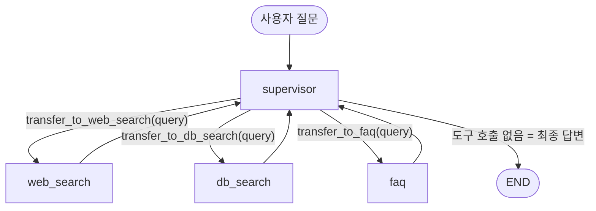

# Supervisor Agent (Triple) 구조 정리

Supervisor 에이전트 하나가 사용자 질문을 분석해서 **Web Search / DB Search / FAQ** 세 전문 에이전트 중 필요한 곳으로 작업을 넘기고(handoff), 결과를 모아 최종 답변을 만드는 LangGraph 멀티 에이전트입니다.

## 1. 파일 구성

| 파일 | 역할 |
|---|---|
| `settings.py` | 공용 상태(`AgentState`), 모델 생성(`get_model`), Supervisor 시스템 프롬프트 |
| `handoff_tools.py` | Supervisor → 에이전트로 넘기는 도구(`transfer_to_*`), 에이전트 → Supervisor 복귀 메시지 생성 |
| `supervisor_agent.py` | handoff 도구 3개를 가진 Supervisor 에이전트 생성, 에이전트 노드 함수 목록(`agents`) |
| `web_agent.py` | Tavily 웹 검색 에이전트 + 그래프 노드 함수 `create_web_agent` |
| `db_agent.py` | Chroma 벡터DB 문서 검색 에이전트 + 노드 함수 `create_db_search_agent` |
| `faq_agent.py` | 사내 FAQ(휴가·근무시간·복리후생·연락처) 에이전트 + 노드 함수 `create_faq_agent` |
| `make_graph.py` | 위 노드들을 `StateGraph`로 엮어 `graph`를 컴파일 (langgraph.json의 진입점) |
| `setup_documents.py` | `documents/`의 PDF·Word 문서를 잘라서 `chroma_db/`에 저장 (최초 1회 실행) |

## 2. 전체 흐름



1. 사용자 메시지가 `supervisor` 노드로 들어갑니다 (`set_entry_point("supervisor")`).
2. Supervisor(gpt-4o)가 질문을 보고 handoff 도구를 호출합니다. 도구의 `query` 인자에 에이전트에게 넘길 질문을 담습니다.
3. handoff 도구가 `Command(graph=Command.PARENT, ...)`를 반환합니다. 그러면 Supervisor 내부 루프를 빠져나와 **부모 그래프**의 해당 에이전트 노드로 이동합니다.
4. 에이전트 노드는 `state["query"]`를 꺼내 자기 전용 에이전트를 **새 대화로** 실행합니다.
5. 결과 메시지 뒤에 "Supervisor로 이동합니다." 메시지 쌍을 붙여 상태에 추가합니다.
6. `add_edge(agent_name, "supervisor")`에 따라 다시 Supervisor로 돌아갑니다.
7. Supervisor는 대화 기록에서 에이전트 결과를 확인합니다. 답변이 가능하면 도구를 호출하지 않고 최종 답변을 생성하고, 그래프가 종료됩니다.

## 3. 상태(State)와 query 전달

```python
# settings.py
class AgentState(MessagesState):
    query: str = None
```

- `messages`: 전체 대화 기록 (`add_messages` 리듀서로 누적)
- `query`: Supervisor가 에이전트에게 넘기는 **질문 한 줄**

에이전트들은 전체 대화 기록을 보지 않고 `query`만 받아서 깨끗한 상태로 실행됩니다.

```python
def create_xxx_agent(state: AgentState) -> Command:
    query = state.get("query", "")                       # 키 이름 오타 주의!
    agent_state = {"messages": [HumanMessage(content=query)]}
    result = xxx_agent.invoke(agent_state)
    ...
```

> 이전에 DB 에이전트만 `state.get("qeury")`로 오타가 있어서 항상 빈 질문이 전달됐습니다 (수정 완료).

## 4. Handoff 도구 (`handoff_tools.py`)

### 4-1. Supervisor → 에이전트: `create_handoff_tool(agent_name, description)`

`transfer_to_{agent_name}` 이름의 도구를 만듭니다. `ToolRuntime`으로 현재 상태(`runtime.state`)와 `tool_call_id`를 주입받습니다.

**도구 1개만 호출한 경우 (`else` 분기)**
```python
return Command(
    goto=agent_name,
    graph=Command.PARENT,
    update={**state, "messages": state["messages"] + [tool_message], "query": query},
)
```
- 성공 `ToolMessage`를 메시지에 추가하고 부모 그래프의 `query`를 갱신한 뒤 해당 노드로 이동합니다.

**도구 여러 개를 동시에 호출한 경우 (`len(tool_calls) > 1`)**
```python
send_list.append(Send(target_agent, {**state, "messages": ..., "query": query_content}))
return Command(graph=Command.PARENT, goto=send_list)
```
- `Send`로 여러 에이전트를 **병렬 실행**합니다. 각 `Send`가 자기만의 `query`를 들고 가므로 에이전트마다 다른 질문을 받을 수 있습니다.
- 첫 번째 도구 호출이 모든 handoff를 한 번에 처리합니다.

### 4-2. 에이전트 → Supervisor: `create_handoff_messages(agent_name)`

실제 도구 호출 없이 아래 두 메시지를 만들어 반환합니다.

```
AIMessage(name=agent_name, content="Supervisor로 이동합니다.", tool_calls=[transfer_back_to_supervisor])
ToolMessage(content="supervisor로 성공적으로 작업을 전달했습니다.")
```

Supervisor 프롬프트는 **"Supervisor로 이동합니다." 바로 앞 메시지 = 에이전트의 최종 결과**라는 규칙으로 결과를 찾습니다. 그래서 이 메시지 쌍이 결과의 구분선 역할을 합니다.

## 5. 각 에이전트

| 노드 이름 | 에이전트 | 도구 | 비고 |
|---|---|---|---|
| `web_search` | `web_agent` | `TavilySearch` | 시스템 프롬프트 없음 |
| `db_search` | `db_agent` | `vector_retriever`, `list_all_documents` | `list_all_documents`로 문서 목록부터 확인하도록 지시 |
| `faq` | `faq_agent` | `get_vacation_policy`, `get_work_hours_info`, `get_benefits_info`, `get_contact_info` | 하드코딩된 사내 정보 반환 |

모두 `langchain.agents.create_agent` + `gpt-4o`로 만든 ReAct 에이전트이고, 노드 함수는 같은 패턴입니다:
`query 꺼내기 → 에이전트 실행 → 복귀 메시지 붙이기 → Command(update=messages, goto=END)`

> `goto=END`를 반환하지만 `make_graph.py`에 `agent → supervisor` 엣지가 있어서 Supervisor로도 돌아갑니다.

### DB 검색 (`db_agent.py`)
- `vector_retriever(query, filename="")`: 상위 10개 청크를 검색하고, `filename`을 주면 `{"file_name": filename}` 메타데이터로 필터링합니다. 결과는 파일별로 묶어 최대 5개씩 출력합니다.
- `list_all_documents()`: 저장된 청크 메타데이터를 파일별로 묶어 문서 목록과 청크 수를 보여줍니다.

## 6. 문서 DB 준비 (`setup_documents.py`)

1. `documents/` 폴더의 파일을 읽습니다. `.pdf`는 `PyPDFLoader`, `.docx/.doc`는 `Docx2txtLoader`를 씁니다.
2. `RecursiveCharacterTextSplitter(chunk_size=1000, chunk_overlap=200)`로 자릅니다.
3. 각 청크 앞에 `[문서명: ...]`을 붙이고 메타데이터(`file_name`, `file_name_without_ext`, `file_extension`, `file_type`)를 추가합니다.
4. `text-embedding-3-small`로 임베딩해서 `chroma_db/`의 `documents` 컬렉션에 저장합니다.

> 경로가 `./supervisor_agent_triple/...` 상대경로라서 **`src/ex_1008` 폴더에서 실행**해야 합니다.
> 검색 쪽(`db_agent.py`)도 반드시 같은 임베딩 모델(`text-embedding-3-small`)을 써야 합니다.

## 7. 실행

```bash
# 1) 문서 임베딩 (최초 1회)
cd src/ex_1008
python supervisor_agent_triple/setup_documents.py

# 2) LangGraph 개발 서버 (ex_1008 루트에서)
langgraph dev
```

`langgraph.json`이 `make_graph.py:graph`를 `rag_agent`로 등록하고, `.env`(OPENAI_API_KEY, TAVILY_API_KEY)를 불러옵니다.

## 8. 남아 있는 개선 포인트

- `db_agent.py` `vector_retriever`: 결과 헤더(`'{file_name}' 파일 내 검색결과`)가 루프 밖의 마지막 `file_name`을 사용합니다.
- `handoff_tools.py:31`: `handoff_messages = state["messages"][-1]`은 메시지 하나입니다. 리스트로 쓰려면 `[:-1]`이어야 합니다. 지금은 에이전트들이 `query`만 쓰기 때문에 겉으로 드러나지 않습니다.
- `web_agent.py:10`: `TavilySearch(max_result=3)`은 올바른 파라미터 이름이 `max_results`입니다.
- `db_agent.py:161`: 복귀 메시지 이름이 `"db_agent"`라서 노드 이름 `db_search`와 다릅니다 (동작에는 영향 없음).
